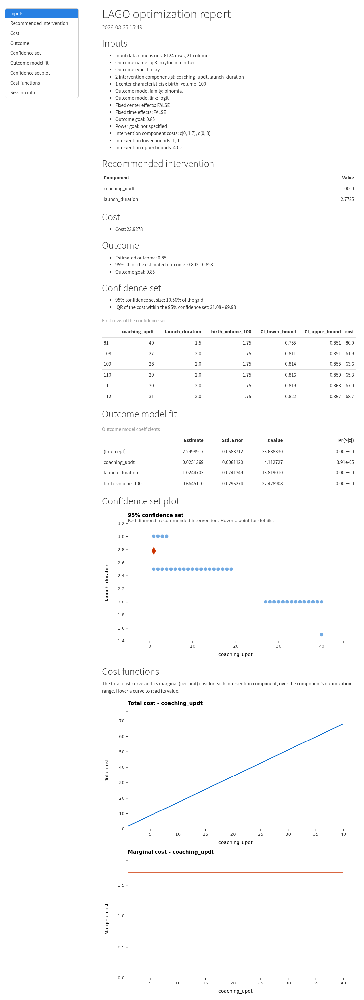
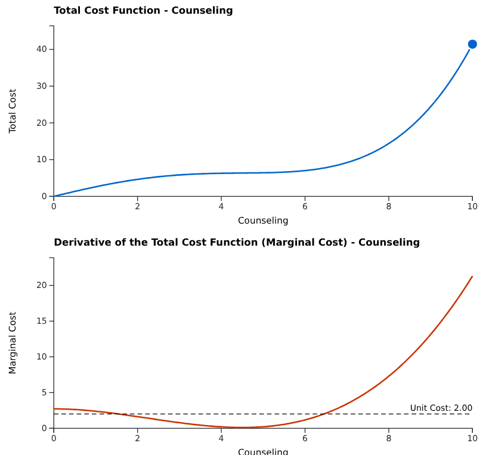
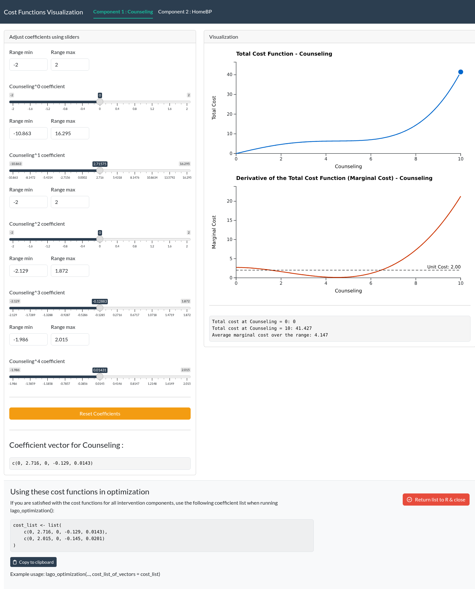

<p align="center">
  <a href="https://www.repostatus.org/#active"></a>
  <a href="https://lifecycle.r-lib.org/articles/stages.html#stable"></a>
  <a href="https://github.com/correspondMerchant/LAGO-R-Package/actions/workflows/R-CMD-check.yaml"></a>
  <a href="https://app.codecov.io/gh/correspondMerchant/LAGO-R-Package"></a>
  <a href="https://www.gnu.org/licenses/gpl-3.0"></a>
  = 2.10">
</p>

# LAGO 

The LAGO R package bridges the gap between theoretical advances in Learn-As-you-GO (LAGO) and practical applications by providing a standardized solution for:
1) fitting the outcome models for both binary and continuous outcomes, including support for fixed center effects/center characteristics and fixed time effects,
2) calculating the recommended interventions based on various optimization criteria, including support for custom cost functions,
3) estimating the optimal intervention based on data from all stages,
4) calculating the 95% confidence sets for the recommended interventions and the optimal interventions.

## Table of Contents
1. [How to install the R package](#how-to-install-the-r-package)
2. [The main functions](#the-main-functions)
3. [Basic use case](#basic-use-case)
4. [More advanced use case](#more-advanced-use-case)
5. [How to run additional examples](#how-to-run-additional-examples)
6. [Using LAGO from Python](#using-lago-from-python)
7. [Relevant LAGO papers](#relevant-lago-papers)
8. [How to get help](#how-to-get-help)


## How to install the R package
- Method 1 (directly using RStudio):
  ```
  install.packages("devtools")
  devtools::install_github("https://github.com/correspondMerchant/LAGO-R-Package")
  ```
- Method 2: Clone this repo into RStudio, you can follow the directions provided [in this video](https://www.youtube.com/watch?v=NInwldFZgwA&t=275s).

## The main functions
The LAGO R package has three user-facing functions `lago_optimization()`, `visualize_cost()`, and `lago_report()`.

`lago_optimization()` carries out the LAGO optimizations, `visualize_cost()` helps you choose cost functions for the intervention components, and `lago_report()` renders a self-contained HTML report of an optimization result.

`lago_optimization()` returns an object of class `"lago"` with `print()`, `summary()`, and `plot()` methods: `print()` (and the identical `summary()`) shows the full result on the console, including an inputs recap, the fitted outcome-model coefficient table, the overall intervention-effect test, the recommended intervention with its cost and estimated-outcome confidence interval, and the confidence set; `plot()` visualizes the confidence set. `lago_report(result)` writes those same sections, plus the confidence-set plot and a session-info footer, to a shareable HTML file.

`lago_optimization()` supports three goal modes: an **outcome goal alone**, a **power goal alone**, or **both together**. At least one of `outcome_goal` or `power_goal` must be provided. When both are provided, the effective outcome goal used for the optimization is the higher of the outcome goal and the outcome level implied by the power goal (the "whichever is higher" rule). A power goal is only supported for binary outcomes and requires a `group` column plus `num_centers_in_next_stage` and `patients_per_center_in_next_stage`; it cannot be combined with `outcome_goal_intention = "minimize"`. When participants are clustered within centers, pass the intra-cluster correlation to `icc` (a single value, or `c(control, treatment)`) and identify the clustering column with `power_goal_cluster_id`. The power calculation then inflates the variance of the test statistic by the design effect, so meeting the same power goal requires a stronger intervention. Without `icc`, the power calculation treats participants as independent.

These functions take many arguments.
To understand the input arguments, read the help files by running the following code in R **(this step is HIGHLY recommended, please do this before moving on to the examples)**:
```
help(lago_optimization)
help(visualize_cost)
help(lago_report)
```

## Basic use case
We consider a hypothetical example based on the built-in R dataset 'mtcars'. The scenario is contrived; its purpose is to demonstrate the mechanics of running a LAGO optimization on a real dataset.

The 'mtcars' data was extracted from the 1974 Motor Trend US magazine, and comprises fuel consumption and 10 aspects of automobile design and performance for 32 automobiles (1973–74 models).
Here, we only focus on the following variables: 'mpg' - miles per gallon, 'gear' - number of forward gears, and 'qsec' - quarter mile time in seconds.

Suppose that 'mpg' is our outcome of interest, and 'gear' and 'qsec' are the two intervention components. We are interested in estimating the recommended intervention package (values of 'gear' and 'qsec') that is expected to achieve an outcome goal of 40 miles per gallon. We expect that the estimated outcome without any intervention is going to be less than 40, and implementing the two intervention components can increase the value of the outcome (which corresponds to setting `outcome_goal_intention = "maximize"`). We are also interested in obtaining the 95% confidence set, which is a list of intervention package compositions that can be expected to include the optimal intervention in 95% of such trials. For the confidence set, we are only interested in the integer values of the intervention components, which corresponds to setting `confidence_set_grid_step_size = c(1, 1)`.

Since 'mpg' is a continuous variable, we can fit a linear regression of the outcome 'mpg' on the predictors 'gear' and 'qsec'. Then, suppose that we know the lower and upper bounds of 'gear' and 'qsec' are: 0 <= 'gear' <= 10 and 0 <= 'qsec' <= 350, and the total monetary cost of implementing the 'gear' ($x_1$) and 'qsec' ($x_2$) are $C(x_1) = 4x_1$, and $C(x_2) = 4 + 6x_2$, respectively.

For running LAGO optimizations:
```
results <- lago_optimization(
  data = mtcars,
  outcome_name = "mpg",
  outcome_type = "continuous",
  glm_family = "gaussian",
  link = "identity",
  intervention_components = c("gear", "qsec"),
  intervention_lower_bounds = c(0, 0),
  intervention_upper_bounds = c(10, 350),
  cost_list_of_vectors = list(c(0, 4), c(4, 6)),
  outcome_goal = 40,
  outcome_goal_intention = "maximize",
  confidence_set_grid_step_size = c(1, 1)
)
```
Typical output:
```
ℹ Starting LAGO Optimization
ℹ Validating inputs...
[1] "When 'cost_list_of_vectors' is provided, 'default_cost_fxn_type' is ignored."
✔ Done
ℹ Assessing the cost function...
✔ Done
ℹ Fitting the outcome model...
✔ Done
ℹ Calculating the recommended intervention...
✔ Done
ℹ Calculating the confidence set...
If the confidence set calculation takes a long time to run, please consider changing the confidence set step size.
✔ Done
→ ♥ LAGO optimization complete ♥
ℹ Printing the output...

── LAGO optimization result ────────────────────────────────────────────────────

── Inputs
Input data dimensions: 32 rows, 11 columns
Outcome name: mpg
Outcome type: continuous
2 intervention component(s): gear, qsec
Outcome model family: gaussian
Outcome model link: identity
Fixed center effects: FALSE
Fixed time effects: FALSE
Outcome goal: 40
Power goal: not specified
Intervention component costs: c(0, 4), c(4, 6)
Intervention lower bounds: 0, 0
Intervention upper bounds: 10, 350

── Outcome model fit

Call:
glm(formula = formula, family = family_object, data = data, weights = weights)

Coefficients:
            Estimate Std. Error t value Pr(>|t|)
(Intercept) -30.7108     9.6702  -3.176 0.003530 **
gear          4.8711     1.0814   4.505 0.000100 ***
qsec          1.8399     0.4465   4.121 0.000288 ***
---
Signif. codes:  0 ‘***’ 0.001 ‘**’ 0.01 ‘*’ 0.05 ‘.’ 0.1 ‘ ’ 1

(Dispersion parameter for gaussian family taken to be 18.84028)

    Null deviance: 1126.05  on 31  degrees of freedom
Residual deviance:  546.37  on 29  degrees of freedom
AIC: 189.61

Number of Fisher Scoring iterations: 2

── Overall intervention-effect test
To see the overall test results, include a 'group' column in the data with
values 'treatment' or 'control' (binary outcomes only).

── Recommended intervention
gear: 10
qsec: 11.9574
Cost: 115.7446
Estimated outcome: 40
95% CI for the estimated outcome: 26.64 - 53.36
Outcome goal: 40

── Confidence set
95% confidence set size: 4.25% of the grid
IQR of the cost within the 95% confidence set: 155.5 - 242.5
First rows of the confidence set (use $cs for all):
   gear qsec CI_lower_bound CI_upper_bound cost
45   10    3          6.902         40.137   62
56   10    4          9.261         41.458   68
67   10    5         11.589         42.810   74
78   10    6         13.881         44.197   80
89   10    7         16.136         45.622   86
99    9    8         15.118         40.577   88
```
The recommended intervention is 'gear' = 10 and 'qsec' = 11.96. The console output shows the full picture: the inputs recap, the fitted outcome-model coefficient table, the overall intervention-effect test, the recommended intervention with its cost and estimated-outcome confidence interval, and the confidence set. `results` is an object of class `"lago"`; `summary(results)` prints the same output, `plot(results)` visualizes the confidence set, and you can access any field directly (for example `results$cs` for the full confidence set, `results$model` for the fitted model, or `results$rec_int` for the recommended intervention). To save a shareable HTML report of the result, run:
```
lago_report(results)
```
This writes a self-contained HTML report with the recommended intervention, the confidence set, and the confidence-set plot:




To adjust the cost functions $C(x_1) = 4x_1$ and $C(x_2) = 4 + 6x_2$, `visualize_cost()` lets you visualize and select cost functions:

`visualize_cost()` creates a Shiny app that allows the user to adjust the coefficients of the cost functions for each intervention component and visualize the resulting total cost function and unit cost function. The initial coefficients are calculated based on the unit costs, the default cost function type (linear or cubic), and the lower and upper bounds.

The user can adjust the coefficients using sliders and reset them to their initial values. The app also displays the current coefficient vector for each component. The user can copy the final coefficient list (at the bottom of the app) for use in `lago_optimization()`.

```
visualize_cost(
  component_names = c("Component 1", "Component 2"),
  unit_costs = c(0.5, 1),
  default_cost_fxn_type = "linear",
  intervention_lower_bounds = c(0, 0),
  intervention_upper_bounds = c(10, 10)
)
```
The cost curves are drawn client-side with D3, so they redraw instantly as you move the sliders (no server round-trip). Hovering a curve shows a read-out at that intervention level, the marginal-cost chart draws a dashed unit-cost reference line, and the right endpoint of the total-cost curve is draggable to rescale all of a component's coefficients at once. When a setting makes the total cost decrease or go negative, the chart is tinted red to flag the invalid state.

The GIF below cycles through several coefficient settings to show these interactions: the curves redrawing live, an endpoint drag, and the red invalid-state tint.

**(please wait a few seconds for the GIF to load)**


A static view of a valid state:




## More advanced use case
We consider a more complicated example, which is adapted from Nevo et al., 2021.

Suppose we want to run LAGO optimization for the BetterBirth Study, a costly failed trial of maternal and newborn care that took place in Uttar Pradesh, India (Hirschhorn et al. 2015; Semrau et al. 2017).
The BetterBirth Study assessed the use of the World Health Organization’s (WHO) Safe Childbirth Checklist, a 31-item checklist of best labor and delivery practices believed to be feasible in resource-limited settings, to reduce maternal and neonatal mortality. The intervention was adapted and tested in a three-phase process. In this setting, neonatal mortality is 32 per 1,000 live births and maternal mortality is 258 per 100,000 births (Semrau et al. 2017).

Suppose that we want to identify the optimal intervention package such that the cost of the intervention is minimized and the probability of a desired binary outcome, oxytocin administered ('pp3_oxytocin_mother'), is above a given threshold (85%).
The two intervention components are 'coaching_updt' ($x_1$), the number of coaching updates, and 'launch_duration' ($x_2$), the launch duration in days. Suppose that we know the lower and upper bounds of 'coaching_updt' and 'launch_duration' are [1,40] and [1,5], respectively. The total costs of the two components are $C(x_1) = 1.7x_1$, and $C(x_2) = 8x_2$, respectively.
In addition, we assign fake centers and fake time periods to all observations to demonstrate fitting outcome models with fixed center and fixed time effects.

Instead of an overall optimal intervention package, we target the optimal intervention package for center "5" in time period "10".

```
# The BetterBirth data has been open sourced so a version of
# the BetterBirth data is included in the LAGO R package
bb_data <- LAGO::BB_data
head(bb_data)

set.seed(123)
## add fake center effects
bb_data$center <- sample(1:10, nrow(bb_data), replace = TRUE)
## add fake time effects
bb_data$period <- sample(1:10, nrow(bb_data), replace = TRUE)

optimization_results <- lago_optimization(
  data = bb_data,
  outcome_name = "pp3_oxytocin_mother",
  outcome_type = "binary",
  intervention_components = c("coaching_updt", "launch_duration"),
  intervention_lower_bounds = c(1, 1),
  intervention_upper_bounds = c(40, 5),
  include_center_effects = TRUE,
  include_time_effects = TRUE,
  center_effects_optimization_values = "5",
  time_effect_optimization_value = 10,
  cost_list_of_vectors = list(c(0, 1.7), c(0, 8)),
  outcome_goal = 0.85,
  outcome_goal_intention = "maximize"
)
```
Output:
```
ℹ Starting LAGO Optimization
ℹ Validating inputs...
'center' column is not a factor type. To ensure the correct model fit, it has been converted to the factor type.
'period' column is not a factor type. To ensure the correct model fit, it has been converted to the factor type.
[1] "When 'cost_list_of_vectors' is provided, 'default_cost_fxn_type' is ignored."
✔ Done
ℹ Assessing the cost function...
✔ Done
ℹ Fitting the outcome model...
✔ Done
ℹ Calculating the recommended intervention...
✔ Done
ℹ Calculating the confidence set...
If the confidence set calculation takes a long time to run, please consider changing the confidence set step size.
✔ Done
→ ♥ LAGO optimization complete ♥
ℹ Printing the output...

── LAGO optimization result ────────────────────────────────────────────────────

── Inputs
Input data dimensions: 6124 rows, 23 columns
Outcome name: pp3_oxytocin_mother
Outcome type: binary
2 intervention component(s): coaching_updt, launch_duration
Outcome model family: binomial
Outcome model link: logit
Fixed center effects: TRUE
Fixed time effects: TRUE
Outcome goal: 0.85
Power goal: not specified
Intervention component costs: c(0, 1.7), c(0, 8)
Intervention lower bounds: 1, 1
Intervention upper bounds: 40, 5

── Outcome model fit

Call:
glm(formula = formula, family = family_object, data = data, weights = weights)

Coefficients:
                  Estimate Std. Error z value Pr(>|z|)
(Intercept)     -7.947e-01  1.345e-01  -5.908 3.47e-09 ***
center2          1.419e-01  1.361e-01   1.043    0.297
center3          8.206e-02  1.370e-01   0.599    0.549
center4         -8.730e-02  1.384e-01  -0.631    0.528
center5          1.790e-02  1.374e-01   0.130    0.896
center6         -1.491e-01  1.413e-01  -1.056    0.291
center7         -1.222e-01  1.362e-01  -0.897    0.370
center8         -2.050e-01  1.381e-01  -1.485    0.138
center9         -2.467e-02  1.380e-01  -0.179    0.858
center10         1.240e-01  1.375e-01   0.902    0.367
period2         -1.455e-01  1.386e-01  -1.050    0.294
period3          5.545e-02  1.348e-01   0.411    0.681
period4         -1.545e-01  1.425e-01  -1.084    0.278
period5         -3.372e-02  1.392e-01  -0.242    0.809
period6          3.380e-02  1.377e-01   0.246    0.806
period7         -1.417e-01  1.415e-01  -1.002    0.316
period8          1.252e-02  1.363e-01   0.092    0.927
period9         -1.844e-01  1.364e-01  -1.353    0.176
period10         1.041e-01  1.362e-01   0.764    0.445
coaching_updt   -2.997e-05  7.668e-03  -0.004    0.997
launch_duration  1.375e+00  8.744e-02  15.726  < 2e-16 ***
---
Signif. codes:  0 ‘***’ 0.001 ‘**’ 0.01 ‘*’ 0.05 ‘.’ 0.1 ‘ ’ 1

(Dispersion parameter for binomial family taken to be 1)

    Null deviance: 8470.8  on 6123  degrees of freedom
Residual deviance: 6344.6  on 6103  degrees of freedom
AIC: 6386.6

Number of Fisher Scoring iterations: 4

── Overall intervention-effect test
To see the overall test results, include a 'group' column in the data with
values 'treatment' or 'control' (binary outcomes only).

── Recommended intervention
coaching_updt: 1.0014
launch_duration: 1.7508
Cost: 15.7083
Estimated outcome: 0.85
95% CI for the estimated outcome: 0.802 - 0.898
Outcome goal: 0.85

── Confidence set
95% confidence set size: 11.85% of the grid
IQR of the cost within the 95% confidence set: 32.4 - 67.75
First rows of the confidence set (use $cs for all):
   coaching_updt launch_duration CI_lower_bound CI_upper_bound cost
78            33            1.45          0.726          0.853 67.7
79            35            1.45          0.722          0.856 71.1
80            37            1.45          0.718          0.860 74.5
81            39            1.45          0.714          0.864 77.9
82             1            1.60          0.769          0.874 14.5
83             3            1.60          0.772          0.872 17.9
```
The outcome model here includes many more coefficients, one per center and per time period, than the previous example, and the console output shows them all. `summary(optimization_results)` prints the same output; inspect `optimization_results$cs` for the full confidence set or `optimization_results$model` for the fitted model, or run `lago_report(optimization_results)` for a shareable HTML report of the result.


## How to run additional examples
This README does not document every input argument, every component of the outcome model, or the optimization algorithm behind the recommended interventions.

**You can also fit 'center-level' data, change the optimization method, add interaction terms and covariates, and test for an overall intervention effect.
Please refer to the R help files and the examples in the [manual tests](https://github.com/correspondMerchant/LAGO-R-Package/tree/main/tests/manual_tests) folder for details.**

You can start with the simpler ones, like the [identity link with built-in dataset](https://github.com/correspondMerchant/LAGO-R-Package/blob/main/tests/manual_tests/test_rec_int_for_cts_identity.Rmd), or the [logistic link with the BetterBirth dataset](https://github.com/correspondMerchant/LAGO-R-Package/blob/main/tests/manual_tests/test_rec_int_for_BB_data.Rmd) before moving on to other files.

If you want to learn how to include a power goal, please start with the file [test_binary_power_goal](https://github.com/correspondMerchant/LAGO-R-Package/blob/main/tests/manual_tests/test_binary_power_goal.Rmd), where the BetterBirth data is used. You must add a `group` column to the data before calling `lago_optimization()`. The `unconditional` power approach is the default; set `power_goal_approach = "conditional"` to use the conditional approach instead. To account for within-center clustering in the power calculation, see [test_icc_power](https://github.com/correspondMerchant/LAGO-R-Package/blob/main/tests/manual_tests/test_icc_power.Rmd), which shows how the `icc` argument shifts the recommended intervention.

The complete set of runnable `.Rmd` examples, grouped by topic:

Recommended interventions:
- [test_rec_int_for_cts_identity](https://github.com/correspondMerchant/LAGO-R-Package/blob/main/tests/manual_tests/test_rec_int_for_cts_identity.Rmd) — continuous outcome with an identity link, on the built-in `mtcars` dataset.
- [test_rec_int_for_BB_data](https://github.com/correspondMerchant/LAGO-R-Package/blob/main/tests/manual_tests/test_rec_int_for_BB_data.Rmd) — binary outcome with a logistic link, on the BetterBirth dataset.
- [test_rec_int_for_BB_data_cts](https://github.com/correspondMerchant/LAGO-R-Package/blob/main/tests/manual_tests/test_rec_int_for_BB_data_cts.Rmd) — BetterBirth proportions modeled as a continuous outcome.

Goal modes and power:
- [test_goal_modes](https://github.com/correspondMerchant/LAGO-R-Package/blob/main/tests/manual_tests/test_goal_modes.Rmd) — three goal modes: an outcome goal alone, a power goal alone, and both together.
- [test_binary_power_goal](https://github.com/correspondMerchant/LAGO-R-Package/blob/main/tests/manual_tests/test_binary_power_goal.Rmd) — power goal for a binary outcome, under the unconditional and conditional approaches.
- [test_icc_power](https://github.com/correspondMerchant/LAGO-R-Package/blob/main/tests/manual_tests/test_icc_power.Rmd) — within-center clustering in the power calculation, via `icc`.

Cost functions:
- [test_default_cost_function](https://github.com/correspondMerchant/LAGO-R-Package/blob/main/tests/manual_tests/test_default_cost_function.Rmd) — default cost function derived from unit costs and bounds.
- [test_higher_order_costs](https://github.com/correspondMerchant/LAGO-R-Package/blob/main/tests/manual_tests/test_higher_order_costs.Rmd) — higher-order (for example, cubic) cost functions.
- [test_visualize_cost](https://github.com/correspondMerchant/LAGO-R-Package/blob/main/tests/manual_tests/test_visualize_cost.Rmd) — `visualize_cost()` Shiny app for choosing cost-function coefficients.

Confidence set and the optimization algorithm:
- [test_confidence_set](https://github.com/correspondMerchant/LAGO-R-Package/blob/main/tests/manual_tests/test_confidence_set.Rmd) — 95% confidence set, and how to read its size and cost range.
- [test_shrinking_method](https://github.com/correspondMerchant/LAGO-R-Package/blob/main/tests/manual_tests/test_shrinking_method.Rmd) — shrinking method, used when the outcome goal is not reachable.
- [test_shrinking_with_power_goal](https://github.com/correspondMerchant/LAGO-R-Package/blob/main/tests/manual_tests/test_shrinking_with_power_goal.Rmd) — shrinking method under a power goal.

Outcome model and testing:
- [test_fit_diagnostics](https://github.com/correspondMerchant/LAGO-R-Package/blob/main/tests/manual_tests/test_fit_diagnostics.Rmd) — fit diagnostics that warn about a questionable outcome model (glm warnings, near-singular estimates, non-significant components) while the optimization continues.
- [test_overall_intervention](https://github.com/correspondMerchant/LAGO-R-Package/blob/main/tests/manual_tests/test_overall_intervention.Rmd) — overall intervention-effect test, reported when a `group` column is supplied.

## Using LAGO from Python

A Python wrapper lives in [`python/`](https://github.com/correspondMerchant/LAGO-R-Package/tree/main/python) (importable as `lago`) for people who work in Python. It calls the real R functions through [`rpy2`](https://rpy2.github.io/), so the results are exactly the ones the R package produces. Because it embeds R, you need R and the installed LAGO R package as well as the Python package.

```python
import pandas as pd
import lago

res = lago.optimize(
    data=df,                                  # a pandas DataFrame
    outcome_name="Y",
    outcome_type="binary",
    intervention_components=["comp1", "comp2"],
    intervention_lower_bounds=[0, 0],
    intervention_upper_bounds=[10, 10],
    cost_list=[[0, 1.7], [0, 8]],
    outcome_goal=0.85,
)
res["rec_int"]           # recommended intervention, a Python list
res["est_outcome_goal"]  # estimated outcome, a float

# visualize_cost() launches the same interactive R app in your browser and
# returns the cost list to Python when you close it:
cost_list = lago.visualize_cost(
    component_names=["comp1", "comp2"],
    unit_costs=[0.5, 1],
    default_cost_fxn_type="cubic",
    intervention_lower_bounds=[0, 0],
    intervention_upper_bounds=[10, 10],
)
```

See [`python/README.md`](https://github.com/correspondMerchant/LAGO-R-Package/blob/main/python/README.md) for installation and the full API.

## Relevant LAGO papers
1. [Nevo D, Lok JJ, Spiegelman D. ANALYSIS OF "LEARN-AS-YOU-GO" (LAGO) STUDIES. Ann Stat. 2021 Apr;49(2):793-819. doi: 10.1214/20-aos1978. Epub 2021 Apr 2. PMID: 35510045; PMCID: PMC9067111.](https://pmc.ncbi.nlm.nih.gov/articles/PMC9067111/pdf/nihms-1761299.pdf)
2. [Bing A, Spiegelman D, Nevo D, Lok JJ. Learn-As-you-GO (LAGO) Trials: Optimizing Treatments and Preventing Trial Failure Through Ongoing Learning. Biometrics, 81(2), ujaf061. DOI: 10.1093/biomtc/ujaf061](https://pmc.ncbi.nlm.nih.gov/articles/PMC12099308/pdf/nihms-2084823.pdf)
3. [Bing A, Spiegelman D, Lok JJ. Learn-As-you-GO (LAGO) Trials: Optimizing Trials for Effectiveness and Power to Prevent Failed Trials. arXiv:2509.11479](https://arxiv.org/pdf/2509.11479)
4. [Bui, M. T., Longenecker, C. T., Bing, A., Spiegelman, D., Webel, A. R., Bosworth, H. B., & Lok, J. J. (2026). Addressing Confounding by Indication Through (Un) Measured Centre Characteristics in Learn-As-you-GO (LAGO) Trials. arXiv preprint arXiv:2604.13276.](https://arxiv.org/abs/2604.13276)

## How to get help
Before reaching out for help, please carefully review this README, examine the descriptions of the arguments in the R help files, run the `.Rmd` files in the [manual tests](https://github.com/correspondMerchant/LAGO-R-Package/tree/main/tests/manual_tests) folder, and read the relevant LAGO papers.

Reach out to [Ante Bing](mailto:abing@bu.edu) or [Minh Bui](mailto:minhb@bu.edu) if you still have questions.


