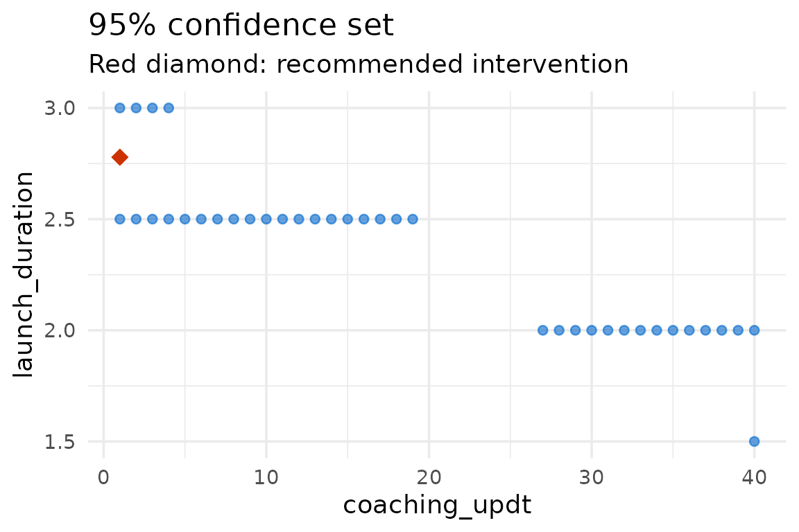

# Optimizing an intervention with LAGO

``` r

library(LAGOtrials)
```

Learn-As-you-GO (LAGO) trials adapt a multi-component intervention as
the trial proceeds. At each stage the intervention is refined using the
data collected so far, so that the next stage moves toward an
intervention that is effective and affordable. The `LAGO` package fits
the outcome model, recommends the lowest-cost intervention package that
is expected to meet an outcome goal (and, optionally, a power goal), and
computes a confidence set for that recommendation.

This vignette walks through a single optimization on the BetterBirth
data that ships with the package. For the full argument reference see
[`?lago_optimization`](https://correspondmerchant.github.io/LAGO-R-Package/reference/lago_optimization.md);
for other worked examples see the [manual
tests](https://github.com/correspondMerchant/LAGO-R-Package/tree/main/tests/manual_tests)
folder.

## The data

`BB_data` is a cleaned version of the BetterBirth study, a trial of the
World Health Organization’s Safe Childbirth Checklist in Uttar Pradesh,
India. The binary outcome `pp3_oxytocin_mother` records whether oxytocin
was administered. We treat two intervention components as adjustable:
`coaching_updt` (number of coaching visits) and `launch_duration` (days
of checklist launch).

``` r

bb_data <- BB_data
head(bb_data[, c("coaching_updt", "launch_duration", "pp3_oxytocin_mother")])
#>   coaching_updt launch_duration pp3_oxytocin_mother
#> 1             0               0                   0
#> 2             0               0                   0
#> 3             0               0                   0
#> 4             0               0                   0
#> 5             0               0                   0
#> 6             0               0                   0
```

## Recommending an intervention

Suppose we want the least costly intervention that raises the
probability of oxytocin administration to at least `0.85`, for a center
with a birth volume of 1.75 (in hundreds). The costs of the two
components are `1.7` and `8` per unit, respectively.

``` r

result <- lago_optimization(
  data = bb_data,
  outcome_name = "pp3_oxytocin_mother",
  outcome_type = "binary",
  intervention_components = c("coaching_updt", "launch_duration"),
  intervention_lower_bounds = c(1, 1),
  intervention_upper_bounds = c(40, 5),
  center_characteristics = "birth_volume_100",
  center_characteristics_optimization_values = 1.75,
  cost_list_of_vectors = list(c(0, 1.7), c(0, 8)),
  outcome_goal = 0.85,
  outcome_goal_intention = "maximize",
  confidence_set_grid_step_size = c(1, 0.5),
  quiet = TRUE
)
#> Warning in (function (data, input_data_structure = "individual_level",
#> outcome_name, : The lower bound for the intervention component coaching_updt is
#> greater than the minimum value in the data.
#> Warning in (function (data, input_data_structure = "individual_level",
#> outcome_name, : The lower bound for the intervention component launch_duration
#> is greater than the minimum value in the data.
```

The `quiet = TRUE` argument suppresses the progress messages so the
vignette output stays clean; it does not change the result.

The returned object has a [`print()`](https://rdrr.io/r/base/print.html)
method that shows the full result on the console: an inputs recap, the
fitted outcome-model coefficient table, the overall intervention-effect
test, the recommended intervention with its cost and the
estimated-outcome confidence interval, and the confidence set:

``` r

result
#> 
#> ── LAGO optimization result ────────────────────────────────────────────────────
#> 
#> ── Inputs
#> Input data dimensions: 6124 rows, 21 columns
#> Outcome name: pp3_oxytocin_mother
#> Outcome type: binary
#> 2 intervention component(s): coaching_updt, launch_duration
#> 1 center characteristic(s): birth_volume_100
#> Outcome model family: binomial
#> Outcome model link: logit
#> Fixed center effects: FALSE
#> Fixed time effects: FALSE
#> Outcome goal: 0.85
#> Power goal: not specified
#> Intervention component costs: c(0, 1.7), c(0, 8)
#> Intervention lower bounds: 1, 1
#> Intervention upper bounds: 40, 5
#> 
#> ── Outcome model fit
#> 
#> Call:
#> glm(formula = formula, family = family_object, data = data, weights = weights)
#> 
#> Coefficients:
#>                   Estimate Std. Error z value Pr(>|z|)    
#> (Intercept)      -2.299892   0.068371 -33.638  < 2e-16 ***
#> coaching_updt     0.025137   0.006112   4.113 3.91e-05 ***
#> launch_duration   1.024470   0.074135  13.819  < 2e-16 ***
#> birth_volume_100  0.664511   0.029627  22.429  < 2e-16 ***
#> ---
#> Signif. codes:  0 '***' 0.001 '**' 0.01 '*' 0.05 '.' 0.1 ' ' 1
#> 
#> (Dispersion parameter for binomial family taken to be 1)
#> 
#>     Null deviance: 8470.8  on 6123  degrees of freedom
#> Residual deviance: 5161.2  on 6120  degrees of freedom
#> AIC: 5169.2
#> 
#> Number of Fisher Scoring iterations: 6
#> 
#> ── Overall intervention-effect test
#> To see the overall test results, include a 'group' column in the data with
#> values 'treatment' or 'control' (binary outcomes only).
#> 
#> ── Recommended intervention
#> coaching_updt: 1
#> launch_duration: 2.7785
#> Cost: 23.9278
#> Estimated outcome: 0.85
#> 95% CI for the estimated outcome: 0.802 - 0.898
#> Outcome goal: 0.85
#> 
#> ── Confidence set
#> 95% confidence set size: 10.56% of the grid
#> IQR of the cost within the 95% confidence set: 31.08 - 69.98
#> First rows of the confidence set (use $cs for all):
#>     coaching_updt launch_duration birth_volume_100 CI_lower_bound
#> 81             40             1.5             1.75          0.755
#> 108            27             2.0             1.75          0.811
#> 109            28             2.0             1.75          0.814
#> 110            29             2.0             1.75          0.816
#> 111            30             2.0             1.75          0.819
#> 112            31             2.0             1.75          0.822
#>     CI_upper_bound cost
#> 81           0.851 80.0
#> 108          0.851 61.9
#> 109          0.855 63.6
#> 110          0.859 65.3
#> 111          0.863 67.0
#> 112          0.867 68.7
```

[`summary()`](https://rdrr.io/r/base/summary.html) renders the same
output:

``` r

summary(result)
#> 
#> ── LAGO optimization result ────────────────────────────────────────────────────
#> 
#> ── Inputs
#> Input data dimensions: 6124 rows, 21 columns
#> Outcome name: pp3_oxytocin_mother
#> Outcome type: binary
#> 2 intervention component(s): coaching_updt, launch_duration
#> 1 center characteristic(s): birth_volume_100
#> Outcome model family: binomial
#> Outcome model link: logit
#> Fixed center effects: FALSE
#> Fixed time effects: FALSE
#> Outcome goal: 0.85
#> Power goal: not specified
#> Intervention component costs: c(0, 1.7), c(0, 8)
#> Intervention lower bounds: 1, 1
#> Intervention upper bounds: 40, 5
#> 
#> ── Outcome model fit
#> 
#> Call:
#> glm(formula = formula, family = family_object, data = data, weights = weights)
#> 
#> Coefficients:
#>                   Estimate Std. Error z value Pr(>|z|)    
#> (Intercept)      -2.299892   0.068371 -33.638  < 2e-16 ***
#> coaching_updt     0.025137   0.006112   4.113 3.91e-05 ***
#> launch_duration   1.024470   0.074135  13.819  < 2e-16 ***
#> birth_volume_100  0.664511   0.029627  22.429  < 2e-16 ***
#> ---
#> Signif. codes:  0 '***' 0.001 '**' 0.01 '*' 0.05 '.' 0.1 ' ' 1
#> 
#> (Dispersion parameter for binomial family taken to be 1)
#> 
#>     Null deviance: 8470.8  on 6123  degrees of freedom
#> Residual deviance: 5161.2  on 6120  degrees of freedom
#> AIC: 5169.2
#> 
#> Number of Fisher Scoring iterations: 6
#> 
#> ── Overall intervention-effect test
#> To see the overall test results, include a 'group' column in the data with
#> values 'treatment' or 'control' (binary outcomes only).
#> 
#> ── Recommended intervention
#> coaching_updt: 1
#> launch_duration: 2.7785
#> Cost: 23.9278
#> Estimated outcome: 0.85
#> 95% CI for the estimated outcome: 0.802 - 0.898
#> Outcome goal: 0.85
#> 
#> ── Confidence set
#> 95% confidence set size: 10.56% of the grid
#> IQR of the cost within the 95% confidence set: 31.08 - 69.98
#> First rows of the confidence set (use $cs for all):
#>     coaching_updt launch_duration birth_volume_100 CI_lower_bound
#> 81             40             1.5             1.75          0.755
#> 108            27             2.0             1.75          0.811
#> 109            28             2.0             1.75          0.814
#> 110            29             2.0             1.75          0.816
#> 111            30             2.0             1.75          0.819
#> 112            31             2.0             1.75          0.822
#>     CI_upper_bound cost
#> 81           0.851 80.0
#> 108          0.851 61.9
#> 109          0.855 63.6
#> 110          0.859 65.3
#> 111          0.863 67.0
#> 112          0.867 68.7
```

The recommended intervention and its cost are available directly:

``` r

result$rec_int
#> [1] 1.000000 2.778472
result$rec_int_cost
#> [1] 23.92777
```

## Visualizing the confidence set

[`plot()`](https://rdrr.io/r/graphics/plot.default.html) shows the 95%
confidence set with the recommended intervention highlighted:

``` r

plot(result)
```



## Adding a power goal

For a binary outcome we can also require a minimum power for the next
stage. A power goal needs a `group` column (“treatment” / “control”) and
the size of the next stage. If the trial is clustered, the power
calculation can additionally account for within-center correlation
through the `icc` argument (with `power_goal_cluster_id` naming the
clustering column); see
[`?lago_optimization`](https://correspondmerchant.github.io/LAGO-R-Package/reference/lago_optimization.md).
The example below uses a power goal alone.

``` r

bb_data$group <- ifelse(bb_data$pre_post == 0, "control", "treatment")

power_result <- lago_optimization(
  data = bb_data,
  outcome_name = "pp3_oxytocin_mother",
  outcome_type = "binary",
  intervention_components = c("coaching_updt", "launch_duration"),
  intervention_lower_bounds = c(1, 1),
  intervention_upper_bounds = c(40, 5),
  center_characteristics = "birth_volume_100",
  center_characteristics_optimization_values = 1.75,
  cost_list_of_vectors = list(c(0, 1.7), c(0, 8)),
  power_goal = 0.8,
  num_centers_in_next_stage = 10,
  patients_per_center_in_next_stage = 30,
  include_confidence_set = FALSE,
  quiet = TRUE
)
#> Warning in (function (data, input_data_structure = "individual_level",
#> outcome_name, : The lower bound for the intervention component coaching_updt is
#> greater than the minimum value in the data.
#> Warning in (function (data, input_data_structure = "individual_level",
#> outcome_name, : The lower bound for the intervention component launch_duration
#> is greater than the minimum value in the data.

power_result$est_outcome_goal
#> [1] 0.4781663
```

When both an outcome goal and a power goal are supplied, the
optimization targets the higher of the two: the outcome goal itself, or
the outcome level implied by the power goal.
